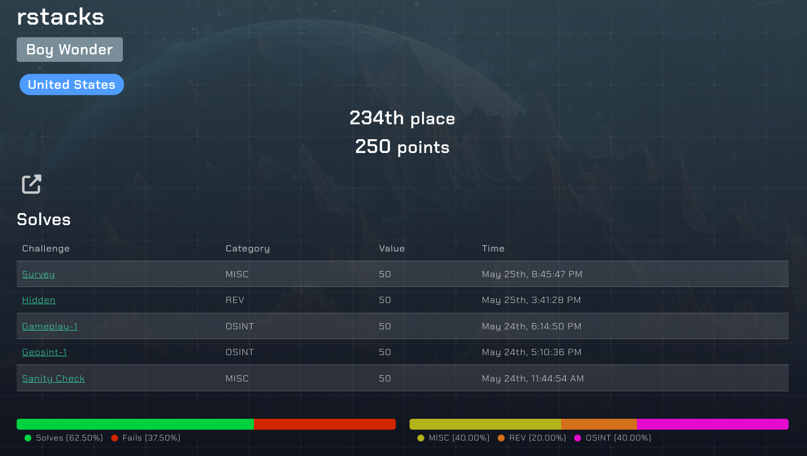

# L3akCTF 2024 Writeup

[L3akCTF 2024](https://ctf.l3ak.team/) was a 48 hour competition that ran from 5/24/2024 to 5/26/2024. This was my first CTF competition, and while I wasn't able to complete many
challenges, I still had a great time and learned some very useful skills.

Below are my solutions to the challenges I managed to complete. I've also included writeups on my progress and thought process for challenges I attempted, but was not able to complete. If you're
curious about my results in the competition, that information is also below.

## Solved Challenges

  
OSINT

  
  * [Gameplay-1](https://github.com/rstacks/L3akCTF2024-writeup/blob/master/OSINT/Gameplay-1.md)
  * [Geosint-1](https://github.com/rstacks/L3akCTF2024-writeup/blob/master/OSINT/Geosint-1.md)
    

  
REV

  * [Hidden](https://github.com/rstacks/L3akCTF2024-writeup/blob/master/REV/Hidden/Hidden.md)
    

## Unfinished Challenges

  
WEB

  * [Simple calculator](https://github.com/rstacks/L3akCTF2024-writeup/blob/master/WEB/SimpleCalculator_UNFINISHED.md)

  
CRYPTO

  * [Really Simple Algorithm](https://github.com/rstacks/L3akCTF2024-writeup/blob/master/CRYPTO/ReallySimpleAlgorithm/ReallySimpleAlgorithm_UNFINISHED.md)
  

## Results

I was the sole member of team Boy Wonder. I scored **250 points** in total and finished **234th out of 497** teams (that solved at least one challenge).

